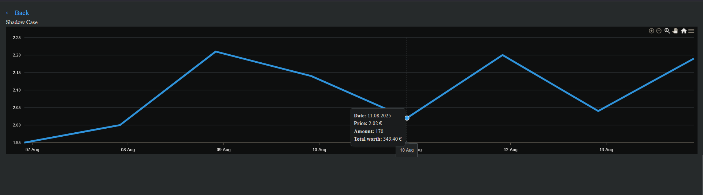

# InventoryProject

A hobby project for tracking and analyzing Steam inventories.
Originally built out of personal interest and because I thought it was fun — later polished into a showcase project demonstrating database design, API development, and frontend visualization.

## Features
- Registers and tracks Steam inventories  
- Fetches market values using proxy servers and multithreading (runtime reduced from ~10 hours to ~3 minutes)  
- Stores data in PostgreSQL  
- Provides a frontend for item tracking, filtering, and visualization  

## Tech Stack
- Python  
- PostgreSQL  
- Svelte  
- Docker  

## Preview

**Frontend page view**  

**Single item view**  
