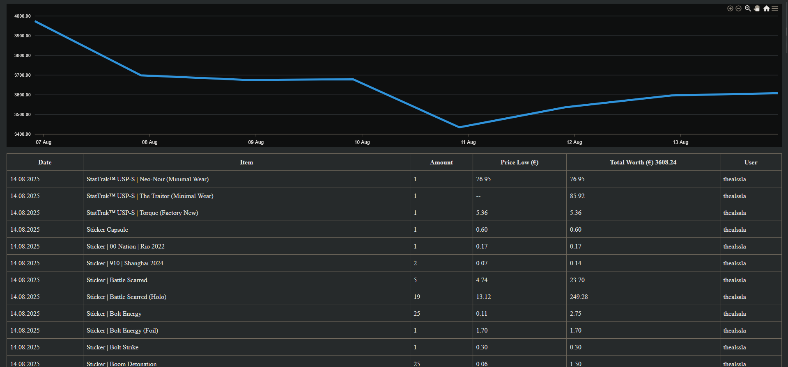

# InventoryProject (Backend)

This backend service tracks Steam user inventories and stores item data in a PostgreSQL database. It also provides endpoints for retrieving item prices, daily worth, and historical data for frontend visualization.

## ⚙️ Tech Stack
- **Python 3.10+**
- **PostgreSQL** for database storage

## 🚀 Getting Started

### Prerequisites
- [Python](https://www.python.org/downloads/) (>= 3.10)
- [PostgreSQL](https://www.postgresql.org/) running locally or remotely
- pip / virtualenv

### Installation
1. Clone the repository
   ```bash
   git clone <your-repo-url>
   cd <backend-folder>
    ```
    Create and activate a virtual environment

python -m venv venv
source venv/bin/activate   # Linux / macOS
venv\Scripts\activate      # Windows

Install dependencies

    pip install -r requirements.txt

    Configure environment variables in .env (e.g. database URL, API keys)

Running the Server

uvicorn main:app --reload

# Features

    Registers and tracks Steam inventories

    Stores data in PostgreSQL

    Provides API endpoints for:

        Daily item prices

        Inventory worth by date

        Single-item history

# Preview

Frontend Page View:



Single Item View:


# TODO

    Clean up frontend integration

    Implement usage of Steam microservice data

    Index storage unit contents

 